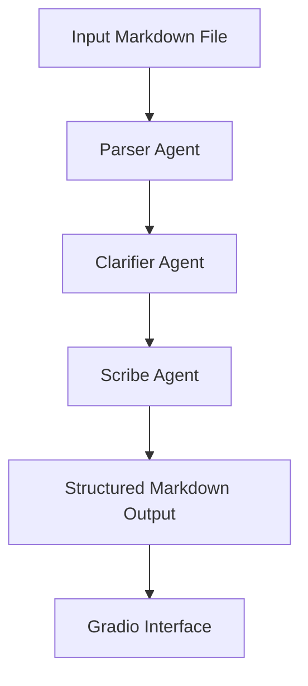

# 🧠 Building Soothsayer  
*A thinking assistant isn’t built in a day. It’s built in loops.*

---

## 📍 What Are We Building?

Soothsayer is not your average chatbot.  
It’s a **CrewAI-powered, modular, local-first agentic system** that helps you translate messy thoughts into structured, sharable communication.

You’ll build a system that:
- Reads structured Markdown documents  
- Thinks through intent, ambiguity, and tone  
- Responds with aligned, reusable documentation  
- Runs fully offline (using Ollama + Mistral)  
- Delivers results via a clean Gradio interface  
- Mirrors your personal loop: **Ideate → Investigate → Iterate → Create**

---

## 💻 System Requirements

| Requirement | Details |
|-------------|---------|
| OS          | macOS, Linux, or Windows (with WSL) |
| Python      | 3.10+ |
| RAM         | 8GB minimum (16GB recommended) |
| Disk Space  | 3GB+ free for Ollama + models |
| LLM         | Ollama + `mistral` model |
| Browser     | Modern browser (for Gradio) |
| Network     | Only needed to pull models; runtime is local |

---

## 🧰 Tools Used

| Component      | Tool / Library         | Purpose |
|----------------|------------------------|---------|
| LLM Engine     | Ollama + Mistral        | Local inference engine |
| Agentic System | CrewAI                  | Multi-agent task coordination |
| Parsing        | Custom Markdown Parser  | Extracts fields from YAML frontmatter |
| Language Chain | LangChain               | Prompt templating and chaining |
| UI             | Gradio                  | Local chat-style interface |
| Style Layer    | Custom CSS              | Matches Sans Serif Sentiments identity |
| Automation     | GitHub Actions (CI)     | Linting and Markdown validation |

---

## 🔁 Thinking Loop → Agent Roles

| Thinking Loop        | Agent Role        | Description |
|----------------------|-------------------|-------------|
| Ideate               | 🧾 Parser Agent    | Reads Markdown and extracts Title, Overview, Purpose |
| Investigate, Iterate | 🧠 Clarifier Agent | Detects ambiguity, refines tone, adds empathy |
| Create               | ✍️ Scribe Agent    | Generates final structured, readable output |

Soothsayer v1 runs these roles within a **single agent**, but you can scale it to modular agents in v2.

---

## 📂 Folder Structure

```plaintext
soothsayer-crewai/
├── agents/
│   └── soothsayer_agent.py
├── configs/
│   └── tools/
│       └── parse_md_function.py
├── input_docs/
│   └── add_numbers.md
├── gradio_ui/
│   └── app.py
├── requirements.txt
├── Dockerfile
├── .github/
│   └── workflows/
│       └── ci.yml
├── BUILDING_SOOTHSAYER.md
└── TECH_STACK.md
```

---

## 🧰 Step-by-Step Setup

### 1. Clone the Repo

```bash
git clone https://github.com/your-username/soothsayer-crewai
cd soothsayer-crewai
```

### 2. Create a Virtual Environment

```bash
python3 -m venv .venv
source .venv/bin/activate  # macOS/Linux
```

### 3. Install Requirements

```bash
pip install -r requirements.txt
```

### 4. Pull the Ollama Model

```bash
ollama pull mistral
```

---

## 📝 Sample Input Markdown File

`input_docs/add_numbers.md`

```markdown
---
Title: Add Numbers Utility
Overview: This function takes two integers and returns their sum.
Why It Matters: Helps simplify repeated addition tasks in our service layer.
---
```

---

## 🧠 The System Prompt (Generated)

In `soothsayer_agent.py`, your Markdown is parsed and injected into the agent's system prompt:

```
You are Soothsayer, an AI strategist built to translate complexity into clarity...

📘 Title: Add Numbers Utility  
📎 Overview: This function takes two integers and returns their sum.  
📌 Why It Matters: Helps simplify repeated addition tasks...
```

---

## 🚀 Launch the Gradio App

```bash
cd gradio_ui
python app.py
```

Your browser will open with a clean Gradio interface where you can paste a messy thought and get structured output.

---

## 🧨 Common Issues and Fixes

### 🔸 Missing Prompt Error

**Error**: `Please provide Prompt Values for: task, lazy_prompt`  
**Fix**: Removed lazy prompt arg and passed full prompt manually to the task.

---

### 🔸 Agent Not Triggering

**Cause**: No Crew instance defined.  
**Fix**:

```python
crew = Crew(
  agents=[soothsayer],
  tasks=[task],
  verbose=True
)
```

---

### 🔸 Markdown Crashing on NoneType

**Cause**: Missing YAML fields like `Overview`.  
**Fix**: Use `.get("Overview", "")` pattern in parser.

---

## 🧪 Example Input → Output

**User Prompt**:  
“I need to document a function that adds numbers but explain why it’s useful for backend design.”

**Output from Soothsayer**:

```markdown
📘 Title: Add Numbers Utility  
📎 Overview: This function takes two integers and returns their sum.  
📌 Why It Matters: This utility supports modular arithmetic operations for API-layer reusability.
```

---

## 📐 System Architecture

```plaintext
Markdown File (.md)
     ↓
parse_md_function.py
     ↓
System Prompt (Title, Overview, Why It Matters)
     ↓
CrewAI Task
     ↓
Soothsayer Agent (Ollama Mistral)
     ↓
Gradio UI → Exported Output (Markdown)
```

---

## 🔄 Modular Agent Flow (Mermaid)



---

## ✏️ Customizing the Agent

Edit the system prompt logic in `soothsayer_agent.py` to:

- Add poetic tone  
- Match department-specific voice  
- Enforce tense, language, or jargon boundaries  

Use your Sans Serif Sentiments identity to guide style choices.

---

## 🧠 What You’ve Built

You didn’t just write a chatbot.  
You built an assistant that:
- Thinks like a writer  
- Reflects like a strategist  
- Structures like a documentarian  

And it’s fully yours — local, extensible, and private.

---

## 🔗 What's Next?

- `TECH_STACK.md` — Deployment, Docker, CI/CD  
- Expand to multi-agent setup  
- Add memory or feedback loop  
- Export HTML/PDF from output  
- Streamlined Slack → Doc workflows

---

## ✍ Author

**Shailesh Rawat** (PoeticMayhem)  
Bridging the Thinking Gap — one structured thought at a time.

---

